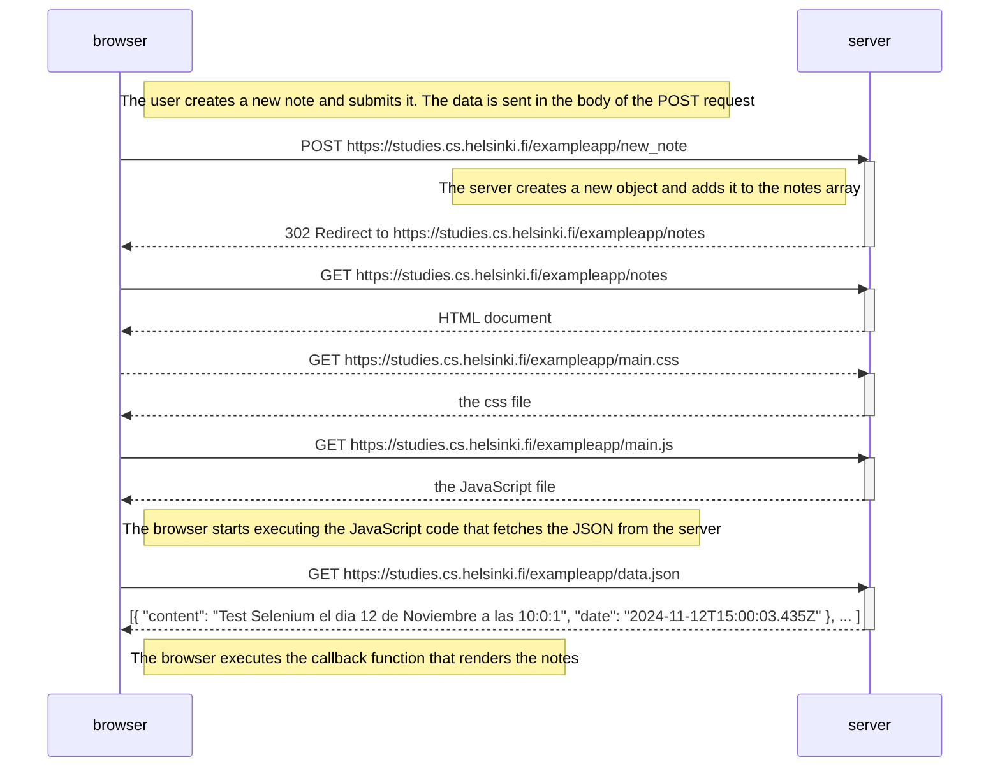

```mermaid
sequenceDiagram
    participant browser
    participant server

    Note right of browser: The user creates a new note and submits it. The data is sent in the body of the POST request
    
    browser->>server: POST https://studies.cs.helsinki.fi/exampleapp/new_note
    
    activate server
    Note left of server: The server creates a new object and adds it to the notes array
    server-->>browser: 302 Redirect to https://studies.cs.helsinki.fi/exampleapp/notes
    deactivate server
    
    browser->>server: GET https://studies.cs.helsinki.fi/exampleapp/notes
    
    activate server
    server-->>browser: HTML document
    deactivate server

    browser-->>server: GET https://studies.cs.helsinki.fi/exampleapp/main.css
    
    activate server
    server-->>browser: the css file
    deactivate server

    browser->>server: GET https://studies.cs.helsinki.fi/exampleapp/main.js
    
    activate server
    server-->>browser: the JavaScript file
    deactivate server

    Note right of browser: The browser starts executing the JavaScript code that fetches the JSON from the server

    browser->>server: GET https://studies.cs.helsinki.fi/exampleapp/data.json
    
    activate server
    server-->>browser: [{ "content": "Test Selenium el dia 12 de Noviembre a las 10:0:1", "date": "2024-11-12T15:00:03.435Z" }, ... ]
    deactivate server

    Note right of browser: The browser executes the callback function that renders the notes
```
